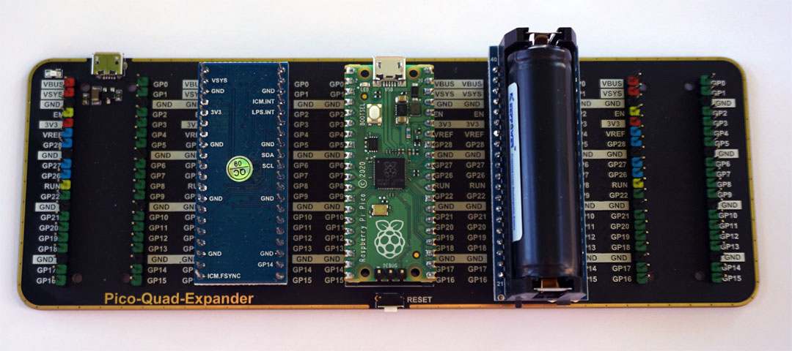

# Weather balloon project

In this project I use a Raspberry Pi Pico and 2 extension modules to design a weather balloon experiment.

The purpose of this experiment is to measure flight parameters of the balloon (X,Y,Z acceleration, pressure and temperature).

The programming language is MicroPython.

## Hardware setup.

- A Raspbery Pi Pico.
- A [10-DOF IMU](https://www.waveshare.com/wiki/Pico-10DOF-IMU) from Waveshare.
- A battery module [Pico UPS A](https://www.waveshare.com/wiki/Pico-UPS-A) from Waveshare.

For the prototype I also use a [Quad GPIO Expander](https://www.waveshare.com/pico-quad-expander.htm) from Waveshare

*Prototype setup.*

## Software (in MicroPython).

[acc_pt_log.py](acc_pt_log.py), performs data acquisition on the 10-DOF IMU. The code uses 2 modules icm20948_mod.py and
lps22 hb_mod.py (see embedded-sensors repository : [Pico_IMU_10DOF](https://github.com/pcamus/embedded-sensors/tree/main/Pico_IMU_10DOF))

The code appends X,Y,Z acceleration data from the ICM20948 chip to the binary file `acc.bin` and pressure + temperature from the LPS22HB chip to `Press_Temp.bin`.

Acceleration is sampled each 100 ms and pressure + temperature each second. Each value is converted into 2 bytes. 

[bin_to_csv.py](bin_to_csv.py), creates csv files from the binary files. 
