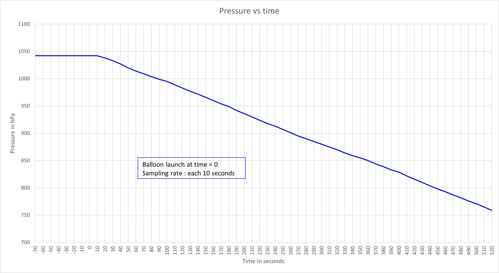
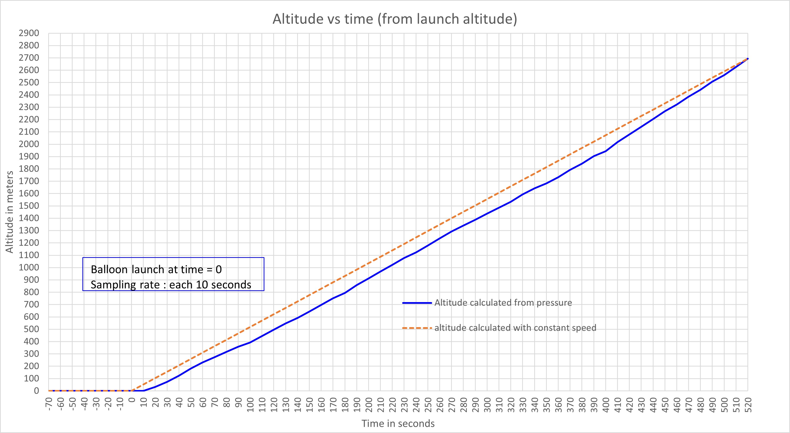
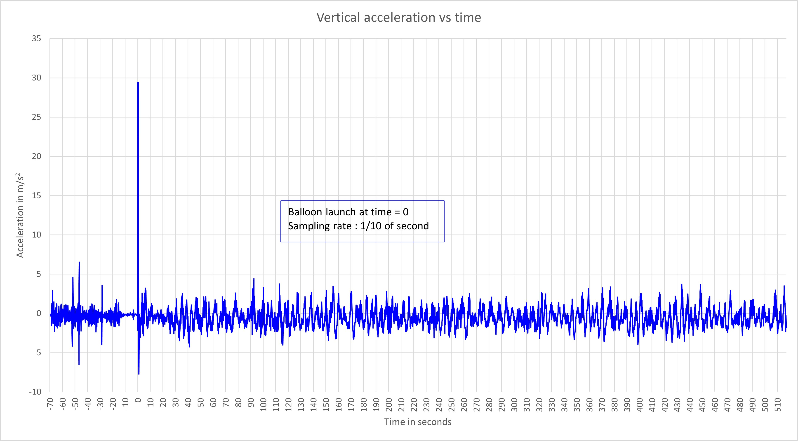
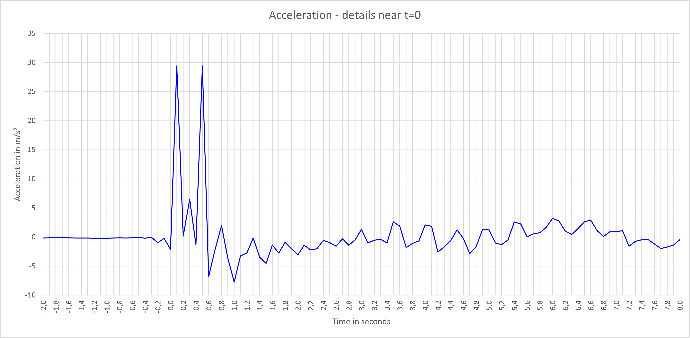

# Flight results

Due to an incorrect value for the flight duration in the MicroPython program, the data logging was only made for 30 minutes of which only 10 correspond to the flight (up to an altitude of 2600 m).

The flight peaked at 34 km altitude. Its total duration was 2h15.

**Pressure variation during the flight:**

The formula giving altitude (h) versus pressure (p) is:  the following $h=\frac{R.T}{\mu.g}ln(\frac{p}{p_0})$

With : 

- h : altitude above ground
- R : ideal gaz constant = 8.3143 J/K.mol
- T : temperature at altitude h (in °K)
- $\mu$ : air molar mass = 0.02896 kg/mol
- g : gravity of earth = 9.81 m/$s^2$
- $p_0$ : pressure at ground

Substituing with the numerical values leads to $h=-29.2656\ T\ ln(\frac{p}{p_0})$

For example at t = 520 s, the measured pressure was 759 hPa , with a ground pressure $p_0$ of 1042 hPa and a temperature of 290.5°K, the altitude above ground h given by the formula is: **2694 m**.

*The altitude above ground given by the tracking at this moment was: **2960 m**.*

**Altitude calculated from the pressure vs altitude with constant rate of ascent:**

The average speed is **5.18 m/s**

/
**Vertical acceleration:**

Thank you to the IRM for allowing us to use its balloon and a very big thanks for the radio amateurs of the [UBA](https://www.uba.be/fr/radioamateurisme) who recovered the probe.

The flight dashboard is [here](https://grafana.v2.sondehub.org/d/HJgOZLq7k/basic?var-Payload=ON4IR-1&from=1664025700000&to=1664035752000&orgId=1).

[Here is a pic of me ready to launch the balloon](IRM2209_03.jpg).
