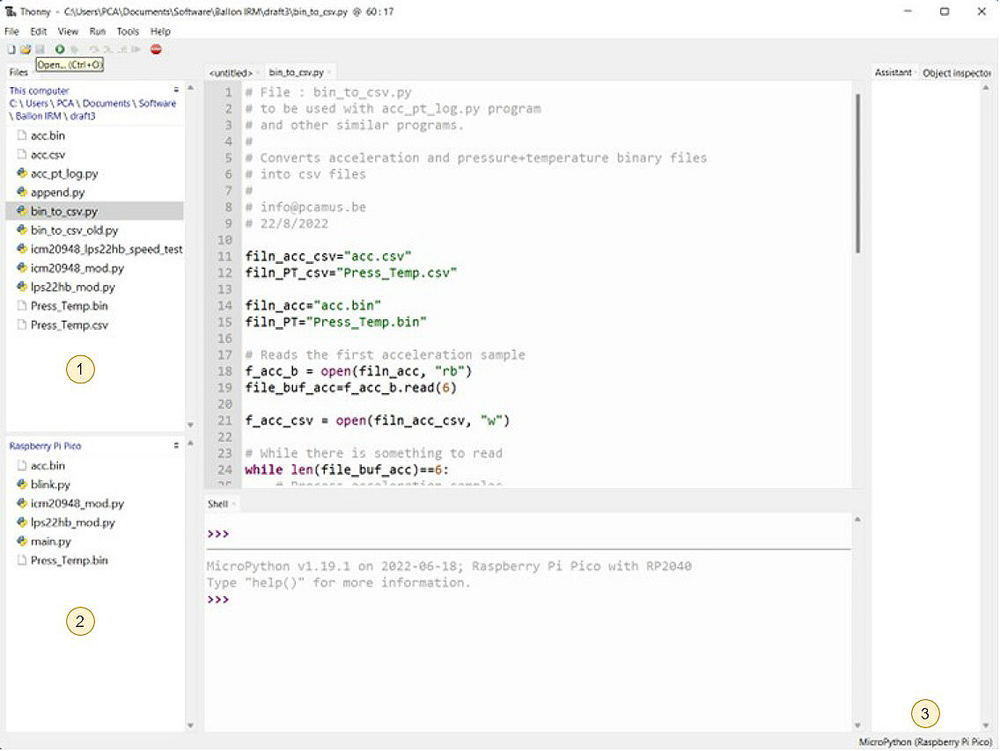
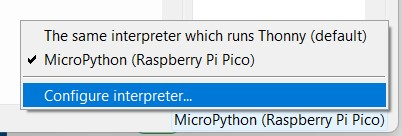

## How to use the system.

To program and retrieve files form the Raspberry Pi Pico I used the Thonny IDE.

I worked with two interpreters : 

- The default Thonny interpreter, running on my computer.
- The MicroPython interpreter running on the Pico board.

The interface is the following :

- `1` is the current directory on my computer.
- `2` is the current directory on the Pico.
- `3` shows which interpreter is in use (to change click on this item).

*Interpreter choice :*

For informations about installing MicroPython interpreter see [here](https://www.raspberrypi.com/documentation/microcontrollers/micropython.html).

### Program installation.

Connect the Pico to your computer with PICO-UPS-A board switch in OFF position.

In your working directory install `acc_pt_log.py`, `icm20948_mod.py`, `lps22hb_mod.py` and `bin_to_csv.py`

`icm20948_mod.py`, `lps22hb_mod.py` are in the embedded-sensors repository : [Pico_IMU_10DOF](https://github.com/pcamus/embedded-sensors/tree/main/Pico_IMU_10DOF)

Rename `acc_pt_log.py` as `main.py` (MicroPython starts automatically main.py at reset).

With the MicroPython interpreter selected, copy `main.py`, `icm20948_mod.py` and `lps22hb_mod.py` to the Pico (right click on the files then Upload to /)

Disconnect your computer. The logging will start when you switch ON the PICO-UPS-A for a duration equal to the value of the LOG_TIME variable (in main.py).

### Retrieving data files.

Connect the Pico to your computer with PICO-UPS-A board switch in OFF position and select the MicroPython interpreter.

This will automatically start a new acquisition, so stop it by clicking on the stop button. Then refresh the Raspberry Pi Pico file window (menu at the top right of the window).

Then click right successively on the `acc.bin` and `Press_Temp.bin` files and choos Download to... The files will be copied in your computer directory.

**Then switch to the default interpreter** (running on your computer) and run the `bin_to_csv.py` program. If you don't switch to the default interpreter the `bin_to_csv.py` program will try to create the csv file into the Pico flash memory which is not big enough for this !

After refreshing the files windows `acc.csv` and `Press_Temp.csv` will be present.

